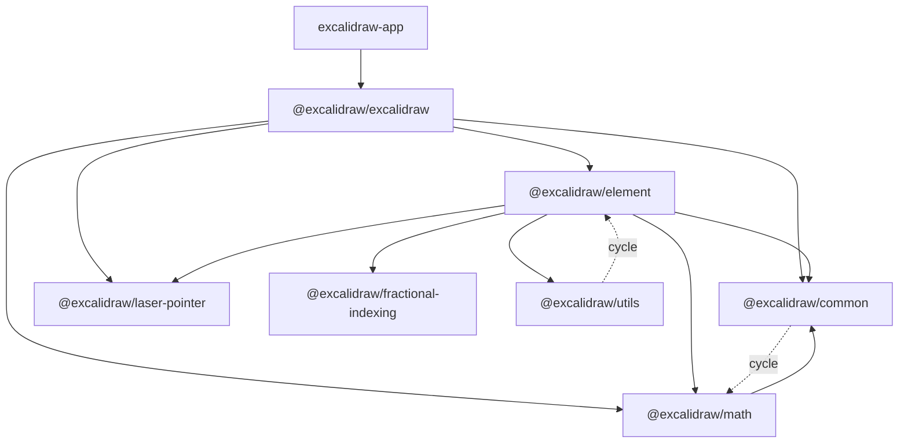
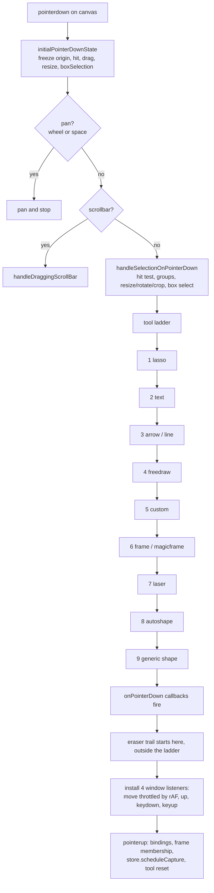
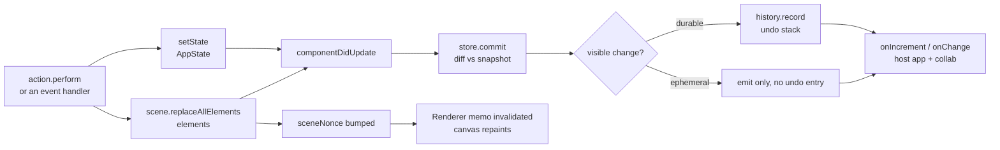
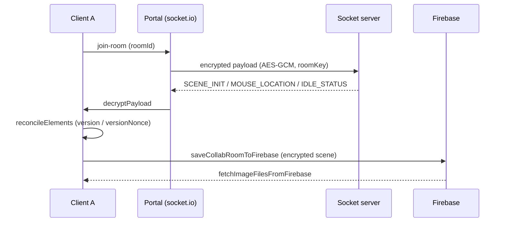

# Architecture map — Excalidraw codebase

A guide for someone who just joined this repo. It answers three questions:

1. What is this codebase made of?
2. Where do I put my hands for a given task?
3. Which parts are safe to touch, and which will bite?

Every fact here was checked against the source on branch `master`. Line numbers move, so treat them as hints, not contracts.

---

## 1. What this repo is

A Yarn 1 monorepo (`yarn@1.22.22`, Node `>=18`) with three kinds of code:

| Part | What it is |
| --- | --- |
| `packages/*` | The editor engine and its support libraries. This is the product. |
| `excalidraw-app/` | The web app around it: persistence, collaboration, sharing, telemetry. |
| `examples/*` | Integration samples. Not part of the build we ship. |

Yarn workspaces are `["excalidraw-app", "packages/*", "examples/*"]`.

Rough size: the editor package is about 116k lines, the element engine 33k, the app 8.7k. One single file — `packages/excalidraw/components/App.tsx` — is 13,848 lines. Section 12 has the measured numbers.

---

## 2. The package map

Seven workspaces under `packages/`. All are named `@excalidraw/<dir>`.



### What each package is

| Package | Size (src) | Role |
| --- | --: | --- |
| `common` | 3,915 LOC | Constants, generic utils, colors, keys, font metadata, event bus, small data structures (heap, queue, pool). |
| `math` | 2,351 LOC | Geometry: point, vector, line, segment, curve, ellipse, polygon, triangle, angle, range, PCA. |
| `element` | 33,183 LOC | The element engine: types, bounds, hit-testing, resize, binding, text, deltas, frames, groups, z-order. |
| `utils` | 801 LOC | Thin facade: `exportToCanvas/Blob/Svg/Clipboard` plus a geometric-shape abstraction. |
| `excalidraw` | ~116k LOC | The React editor component. Everything the user sees and touches. |
| `fractional-indexing` | 322 LOC | Vendored `generateNKeysBetween`. No tests. |
| `laser-pointer` | 527 LOC | Vendored laser trail maths. No tests. |

### Dependency direction, and where it breaks

The intended direction is `common → math → element → excalidraw`. Reality has three deviations you will meet:

1. **`common ↔ math` is a real runtime cycle.** `math/src/range.ts:1` imports `toBrandedType` from `common`; `common/src/utils.ts:1` imports `average` from `math` (also `common/src/colors.ts:3-4`, `common/src/points.ts:1-6`).
2. **`element ↔ utils` is a real runtime cycle.** `element/src/bounds.ts:16` imports `getCurvePathOps` from `@excalidraw/utils/shape`; `utils/src/shape.ts:37` imports `getElementAbsoluteCoords` back from `@excalidraw/element`.
3. **`element` and `common` import types from the React package.** 33 files in `element` and 5 in `common` do `import type { AppState } from "@excalidraw/excalidraw/types"` or similar. All are type-only imports, so there is no runtime edge — but `AppState` lives in the React package and the engine reads its shape.

Practical effect: do not plan work that assumes `element` can be lifted out on its own as a headless core.

### Highest fan-in

If you change one of these, you change everything downstream:

| File                            | Files importing it |
| ------------------------------- | -----------------: |
| `packages/common/src/index.ts`  |                298 |
| `packages/element/src/types.ts` |                215 |
| `packages/excalidraw/types.ts`  |                189 |
| `packages/element/src/index.ts` |                132 |
| `packages/math/src/index.ts`    |                 91 |

---

## 3. The editor: what `App` owns

`packages/excalidraw/index.tsx` is the public entry. It exports `Excalidraw = React.memo(ExcalidrawBase, areEqual)`.

`areEqual` (`index.tsx:257-388`, ~132 lines) is a **hand-written** comparison: it checks `activeTool`, `interaction`, `ui`, `UIOptions` (with special cases for `getFormFactor` and `export.saveFileToDisk`), `imageOptions`, then falls back to `isShallowEqual`. `initialData` is deliberately excluded. If you add a prop that holds an object, and you do not teach `areEqual` about it, memoization silently breaks in one direction or the other. No test enforces this.

Below that sits one class: **`packages/excalidraw/components/App.tsx`, 13,848 lines**. It is the single biggest maintenance fact in the repo.

`App` owns these collaborators as instance fields:

| Field           | What it is                                             |
| --------------- | ------------------------------------------------------ |
| `scene`         | `Scene` — the elements and their caches                |
| `renderer`      | `Renderer` — memoized visible-element computation      |
| `store`         | `Store` (private) — change capture, the source of undo |
| `history`       | `History` (private) — the undo/redo stacks             |
| `actionManager` | `ActionManager` — keyboard and panel action dispatch   |
| `library`       | `Library` — library items                              |
| `fonts`         | `Fonts` — font loading and subsetting                  |
| `rc`            | `RoughCanvas` — the hand-drawn renderer                |

Partially extracted helpers live beside it: `App.viewport.ts` (817), `App.drawshape.ts`, `App.flowchart.ts`, `App.cursor.ts`, `AppStateObserver.ts`. The extraction is partial and ongoing — new work should extend these rather than grow the class.

The public imperative API is literally `App`'s method signatures: `ExcalidrawImperativeAPI` in `types.ts` is mostly `InstanceType<typeof App>["someMethod"]` aliases. So renaming a private method on `App` can change the published type surface. Check before you rename.

### The pointer-down state machine

Everything the user draws goes through `handleCanvasPointerDown` (`App.tsx:8267`).



The ladder order matters and is easy to get wrong from memory: **lasso, text, arrow/line, freedraw, custom, frame/magicframe, laser, autoshape, then the generic `else`**. The generic branch excludes `eraser`, `hand` and `image`. The eraser starts its trail in a _separate_ `if` at `App.tsx:8726`, after the `onPointerDown` callbacks have already fired.

The two handlers returned by pointer-down are the largest methods in the file: `onPointerUpFromPointerDownHandler` (~1000 lines) and `onPointerMoveFromPointerDownHandler` (~895 lines). Together they are 14% of `App.tsx`.

---

## 4. State: four mechanisms at once

This is the part that confuses every newcomer. There is no single store. There are four, and they have different jobs.



### 1. `this.state` — `AppState`

A React class state with **93 top-level fields** (`packages/excalidraw/types.ts:315-531`). It holds UI chrome, the in-progress interaction, the active tool, the `currentItem*` style defaults, the viewport, the selection, binding preferences, collaborators and the editor modes.

It is projected into narrower read-only views so the UI does not re-render on every scroll: `UIAppState`, `StaticCanvasAppState`, `InteractiveCanvasAppState`, and — importantly — `ObservedAppState`, which is the **only** part of app state the Store diffs for history.

### 2. `Scene` — the elements

`packages/element/src/Scene.ts` (446 lines). Elements do not live in React state. `Scene` owns `elements`, `elementsMap`, `nonDeletedElements`, `nonDeletedElementsMap`, `frames`, `nonDeletedFramesLikes`, a selected-elements cache, and `sceneNonce`.

`replaceAllElements` rebuilds all the maps and then bumps `sceneNonce` via `triggerUpdate()`. The selected-elements cache is _not_ rebuilt there — it self-invalidates by identity check in `getSelectedElements`, and is only hard-cleared in `destroy()`.

`sceneNonce` is the render cache key. Remember that name; section 5 uses it.

### 3. `Store` — change capture and undo source

`packages/element/src/store.ts` (1,037 lines). Every action declares its undo semantics with `CaptureUpdateAction`, which has exactly three values:

| Value         | Meaning                                      |
| ------------- | -------------------------------------------- |
| `IMMEDIATELY` | Capture now — this is an undoable step.      |
| `NEVER`       | Do not capture. Ephemeral, e.g. a live drag. |
| `EVENTUALLY`  | Fold into the next capture.                  |

`Store.commit` diffs against a snapshot and emits either a `DurableIncrement` (which history records) or an `EphemeralIncrement` (which it does not). Getting the wrong `CaptureUpdateAction` on a new action does not crash anything — it silently corrupts undo. The source itself flags `scheduleCapture` as called from suspiciously many places.

The delta maths is next door in `packages/element/src/delta.ts` (2,071 lines): `Delta<T>`, `AppStateDelta`, `ElementsDelta`, plus the `DeltaContainer` interface. `applyTo` is transactional — it copies the map, applies added/removed/updated deltas, resolves conflicts, and reports whether the result contains a visible or a z-index difference.

### 4. `History` — the stacks

`packages/excalidraw/history.ts` (249 lines). Thin layer over Store deltas. `HistoryDelta extends StoreDelta` and its `applyTo` passes `excludedProperties: new Set(["version", "versionNonce"])`, so an undo looks like a fresh user edit to collaborators instead of a version rollback.

### Jotai, and what it is _not_ for

`packages/excalidraw/editor-jotai.ts` uses `createIsolation()` from `jotai-scope`, so the editor's atoms never collide with a host app's. Atoms are used only for **UI-local** state: dialogs, color picker, sidebar, library, search, eyedropper. Scene state never lives in an atom. ESLint blocks importing bare `jotai` — use `editor-jotai` (library) or `app-jotai` (app).

### Mutation

`packages/element/src/mutateElement.ts` bumps `version`, `versionNonce` and `updated`, and invalidates the shape cache. But it is not the entry point application code calls:

```
App.mutateElement  →  Scene.mutateElement  →  mutateElement
   (App.tsx:5247)      (Scene.ts:411, also
                        fires informMutation)
```

Only 13 files import `./mutateElement` directly. And there is direct mutation in production code outside that path — `restore.ts:728,793,796,813` and `transform.ts:532,768` assign to element fields straight up. So "all mutation goes through one function" is the intent, not the invariant.

---

## 5. The render pipeline

Three stacked `<canvas>` elements, each a `React.memo` with its own comparison.

| Layer | Component | Renderer | Why it exists |
| --- | --- | --- | --- |
| Static | `components/canvases/StaticCanvas.tsx` | `renderer/staticScene.ts` (508) | The finished drawing. Expensive; repaint rarely. |
| Interactive | `components/canvases/InteractiveCanvas.tsx` | `renderer/interactiveScene.ts` (2,102) | Selection, handles, binding highlights, remote cursors. |
| New element | `components/canvases/NewElementCanvas.tsx` | `renderer/renderNewElementScene.ts` (105) | The shape being drawn right now, so the static layer is not re-rasterized every frame. |

`packages/excalidraw/scene/Renderer.ts:159` memoizes visible-element computation on a `canvasNonce`, built at `:210` as the scene nonce plus, when the new element is inside a frame, its `versionNonce`. `staticScene.ts:489` wraps the static repaint in `throttleRAF`; a non-throttled `renderStaticScene` exists for exports and tests.

There is a second cache below that. `ShapeCache` (`packages/element/src/shape.ts:82-112`) is a `WeakMap<ExcalidrawElement, {shape, theme}>` holding generated RoughJS shapes. `mutateElement.ts:136` evicts it. The catch: it is read on the **geometry** path too — `bounds.ts:968` and `linearElementEditor.ts:2008` — so a cache bug shows up as wrong hit-testing, not just wrong pixels.

`renderer/staticSvgScene.ts` (801 lines) is the SVG export twin of `staticScene.ts`. The two must be kept in step by hand. Drift is caught only by export snapshot tests.

---

## 6. The action system

Almost every user-facing command is an `Action`. `packages/excalidraw/actions/types.ts` defines the contract, with a closed `ActionName` union of **98 members** (`:45-143`).

```ts
{
  name, label, keywords?, icon?,
  PanelComponent?,        // how it renders in a panel
  perform,                // returns { elements?, appState?, files?, captureUpdate }
  keyTest?, keyPriority?, // keyboard binding
  predicate?,             // is it available right now?
  viewMode?, navigation?, // gating flags
  trackEvent
}
```

`actions/manager.tsx` registers them and dispatches. Two behaviours worth knowing:

- `handleKeyDown` sorts candidates by `keyPriority`, filters them, and then **bails if more than one matches**, with `console.warn("Canceling as multiple actions match this shortcut")`. A new shortcut that collides therefore disables both, quietly.
- `isActionEnabled` evaluates **only** `predicate`.

### Five gates, not three

An action can be blocked by any of these:

1. `UIOptions.canvasActions[name]` — the host app can remove it from keyboard _and_ panels.
2. `action.viewMode` versus `appState.viewModeEnabled`.
3. `action.navigation` versus `isInteractionEnabled()` / `isNavigationEnabled()`.
4. `action.predicate`, via `isActionEnabled`.
5. `isActionBlockedByViewportTransition` (`manager.tsx:88`) — a `navigation` action is blocked while `app.viewport.isLockedTransitionPending`.

They are not fully independent: `handleKeyDown` returns early when neither interaction nor navigation is enabled, and `executeAction` exempts calls whose `source === "api"`.

This matters whenever you want to hide a command: gate 4 in particular does **not** cover keyboard shortcuts, because `handleKeyDown` never evaluates `predicate`. Removing a button is not the same as removing the capability.

### Where the action files are

| Concern | Files |
| --- | --- |
| Style / properties | `actionProperties.tsx` (2,165 — the whole style panel), `actionStyles.ts`, `actionBoundText.tsx` |
| Canvas & view | `actionCanvas.tsx`, `actionToggle*.tsx`, `actionNavigate.tsx`, `actionMenu.tsx` |
| Selection/geometry | `actionSelectAll.ts`, `actionAlign.tsx`, `actionDistribute.tsx`, `actionFlip.ts`, `actionZindex.tsx`, `actionGroup.tsx` |
| Lifecycle | `actionFinalize.tsx`, `actionDeleteSelected.tsx`, `actionDuplicateSelection.tsx`, `actionHistory.tsx`, `actionElementLock.ts` |
| Input/output | `actionExport.tsx`, `actionClipboard.tsx`, `actionAddToLibrary.ts`, `actionLink.tsx` |

41 `action*` files in total.

---

## 7. The element engine, by concern

`packages/element/src/` is 49 source files and 33k lines. Grouped by what they do:

| Concern | Key files | LOC of the big ones |
| --- | --- | --- |
| Types & schema | `types.ts`, `typeChecks.ts`, `comparisons.ts`, `transform.ts` | types 460, transform 815 |
| Bounds & geometry | `bounds.ts`, `utils.ts`, `distance.ts`, `sizeHelpers.ts` | bounds 1,570, utils 754 |
| Collision / hit-test | `collision.ts`, `shape.ts` | collision 867, shape 1,288 |
| Resize & transform | `resizeElements.ts`, `resizeTest.ts`, `transformHandles.ts`, `dragElements.ts`, `cropElement.ts` | resizeElements 1,511, cropElement 628 |
| Mutation | `mutateElement.ts`, `Scene.ts` | Scene 446 |
| Arrow binding | `binding.ts`, `arrows/focus.ts`, `arrowheads.ts` | **binding 3,156 — biggest file in the repo** |
| Elbow arrows | `elbowArrow.ts`, `heading.ts` | elbowArrow 2,309 |
| Linear element editing | `linearElementEditor.ts` | 2,525 |
| Text | `textElement.ts`, `textWrapping.ts`, `textMeasurements.ts`, `containerCache.ts` | textWrapping 740 |
| Deltas & store | `delta.ts`, `store.ts` | delta 2,071, store 1,037 |
| Ordering | `fractionalIndex.ts`, `zindex.ts`, `sortElements.ts` | zindex 676 |
| Groups & selection | `groups.ts`, `selection.ts` | groups 466 |
| Frames | `frame.ts` | 1,011 |
| Flowchart | `flowchart.ts` | 748 |
| Shape recognition | `convertToShape.ts` (+ `math/src/pca.ts`) | 817 |
| Images & embeds | `image.ts`, `embeddable.ts`, `elementLink.ts` | embeddable 535 |
| Creation | `newElement.ts`, `duplicate.ts` | newElement 555, duplicate 518 |
| Rendering | `renderElement.ts`, `visualdebug.ts` | renderElement 1,050 |

### Type safety in `math`

`packages/math/src/types.ts` defines 15 branded types: `Radians`, `Degrees`, `InclusiveRange`, `GlobalPoint`, `GlobalCoord`, `LocalPoint`, `LocalCoord`, `Line`, `LineSegment`, `Vector`, `Triangle`, `Rectangle`, `Polygon`, `Curve`, `Ellipse`.

A brand is a phantom field, e.g. `type Radians = number & { _brand: "excalimath__radian" }`. It costs nothing at runtime and stops you passing degrees into trig code, or scene coordinates into element-local maths. Most geometry functions are generic over `<Point extends GlobalPoint | LocalPoint>` so they work in either space but cannot mix spaces inside one call.

Two caveats that were verified, not assumed:

- Brands are produced mostly by inline `as` casts, not by factory functions. There are **144** `as Radians | Degrees | GlobalPoint | LocalPoint` casts outside `packages/math`. So the brand is a convention held up by review, not something the compiler can fully police.
- `InclusiveRange` reuses `Degrees`' brand string (`"excalimath_degree"`) — a copy-paste slip. The differing base type still keeps the two distinct, so nothing is broken today.

---

## 8. Data, persistence and migrations

Two layers, easy to confuse.

### Editor-side: `packages/excalidraw/data/`

| File | LOC | Job |
| --- | --: | --- |
| `restore.ts` | 1,202 | The migration funnel. Everything loaded from anywhere passes here. |
| `library.ts` | 1,001 | The `Library` class, merge and hashing of library items. |
| `blob.ts` | 559 | `loadFromBlob`, image decode/resize, data URLs. |
| `encode.ts` | 414 | Scene embedded in PNG/SVG, compression. |
| `json.ts` | 159 | `serializeAsJSON`, `loadFromJSON`, `saveAsJSON`. |
| `reconcile.ts` | 118 | Collab merge: `reconcileElements`, `shouldDiscardRemoteElement`. |
| `encryption.ts` | 94 | AES helpers used by collab and share links. |

`restore.ts` is worth understanding properly, because it is widely misunderstood:

- `restoreElementWithProperties` (`:408-491`) builds `{ ...element, ...base, ...getNormalizedDimensions(base), ...extra }` — it **spreads the original element first, explicitly to keep unknown properties for forward compatibility**. So a new custom property is _not_ stripped here. Only two legacy fields are deleted: `strokeSharpness` and `boundElementIds`.
- What a new property _does_ miss by not being registered here is **normalization and defaulting**. And it can still be dropped by other paths — export cleaning, serialization.
- `repairBinding` (`:276`) contains a real schema migration: binding v1 (legacy) → v2 at `:325`, plus legacy focus-point handling.

It is guarded mainly by `tests/data/restore.test.ts` (1,268 lines, snapshot-heavy).

### App-side: `excalidraw-app/data/`

`LocalData` debounce-saves elements and app state to `localStorage` (`SAVE_TO_LOCAL_STORAGE_TIMEOUT`), and keeps binary files in IndexedDB (`createStore("files-db", "files-store")`). Keys are in `app_constants.ts`:

```
excalidraw            -> elements
excalidraw-state      -> app state
excalidraw-collab     -> collab state
excalidraw-theme      -> theme
version-dataState     -> cross-tab version stamp
version-files         -> cross-tab version stamp
excalidraw-library    -> IndexedDB library
excalidraw-ttd-chats  -> IndexedDB AI chat history
```

**All of these are per-origin and carry no user or document identity.** Anything multi-user or multi-document needs a real backend, not a change here.

---

## 9. The app shell and what it talks to

`excalidraw-app/` is ~8.7k lines. There is no router — three path branches (`/excalidraw-plus-export`, `/web-share-target`, everything else) plus hash state (`#room=`, `#json=`, `#url=`, `?id=`) parsed in `initializeScene` and then erased from the URL with `history.replaceState`.

Collaboration is socket.io plus Firebase:



The room key never reaches the server: the scene is encrypted client-side, and the key lives in the URL fragment. `reconcileElements` resolves conflicts using element `version` and `versionNonce` — which is exactly why `HistoryDelta` excludes those fields on undo.

### External services this build uses

From `.env.production`:

| Service | Endpoint | What for |
| --- | --- | --- |
| Socket server | `oss-collab.excalidraw.com` (`transports: ["websocket","polling"]`) | Live collaboration transport |
| Firebase (Firestore + Storage) | project `excalidraw-room-persistence` | Encrypted room scenes and image files |
| Share-link JSON backend | `json.excalidraw.com/api/v2/` | `#json=` share links |
| Libraries | `libraries.excalidraw.com` + a GCP cloud function | Public library browsing and publishing |
| Excalidraw Plus | `plus.excalidraw.com`, `app.excalidraw.com` | Upsell links and encrypted export |
| AI | `oss-ai.excalidraw.com/v1/ai/*` | Diagram-to-code, text-to-diagram |
| Sentry | Excalidraw's own DSN | Error reporting |
| SimpleAnalytics | `scripts.simpleanalyticscdn.com/latest.js` in `index.html` | Page analytics |

Three of these are active by default and are worth knowing about, because none of them is behind an app-level switch:

1. **Sentry reports on any `*.vercel.app` host.** `excalidraw-app/sentry.ts` maps hostnames to environments and the map includes `"vercel.app"`, so any preview deployment reports errors unless `VITE_APP_DISABLE_SENTRY=true` is set.
2. **SimpleAnalytics is a script tag in `excalidraw-app/index.html`**, independent of app code.
3. The same file redirects `/` to `https://app.excalidraw.com` for visitors carrying the Excalidraw Plus auth cookie.

Also note `.env.production` commits a Firebase web API key and an RSA public key. Both are public-by-design for their purpose, but they identify Excalidraw's own projects.

---

## 10. Risk map — what is safe to touch

Risk here means one thing: how likely is it that editing this file goes wrong, or that you fail to notice it went wrong. Three tiers.

### Hot — dense, high-churn, and failures are quiet

| File | LOC | Why |
| --- | --: | --- |
| `packages/excalidraw/components/App.tsx` | 13,848 | Biggest file, 20+ collaborators, 93-field state, and it implements the public API surface. |
| `packages/element/src/binding.ts` | 3,156 | Biggest engine file. Churns constantly and cross-cuts elbow arrows, linear editing, frames. |
| `packages/element/src/linearElementEditor.ts` | 2,525 | Stateful class mixing pointer interaction, point normalization and mutation. |
| `packages/element/src/elbowArrow.ts` | 2,309 | A\* routing with tuned heuristics. Small numeric changes move routes; not reviewable by reading. |
| `packages/element/src/delta.ts` | 2,071 | Undo and collab reconciliation core. Failures are silent, not loud. |
| `packages/element/src/store.ts` | 1,037 | `CaptureUpdateAction` semantics. Wrong value = corrupted undo. **No dedicated test file.** |
| `packages/excalidraw/renderer/interactiveScene.ts` | 2,102 | High-churn code; ~670 lines are binding visualization alone. |
| `packages/excalidraw/actions/actionProperties.tsx` | 2,165 | The entire style panel in one file. Every new element property lands here. |

### Warm — safe to edit, but read first

| File | LOC | Why |
| --- | --: | --- |
| `packages/element/src/bounds.ts` | 1,570 | High fan-in, and `ElementBounds` caching makes bugs stateful. |
| `packages/element/src/resizeElements.ts` | 1,511 | Dense transform maths across every element type, bound text, frames, crop. |
| `packages/element/src/shape.ts` | 1,288 | `ShapeCache` feeds both painting and hit-testing. No dedicated test. |
| `packages/excalidraw/data/restore.ts` | 1,202 | Migration funnel with a live v1→v2 binding migration. Snapshot-guarded. |
| `packages/common/src/utils.ts` | 1,202 | 94 unrelated exports, imported nearly everywhere. |
| `packages/element/src/frame.ts` | 1,011 | Frame membership interacts with groups, z-order, duplication and selection. |
| `packages/element/src/renderElement.ts` | 1,050 | Per-element canvas drawing plus its own canvas cache. No dedicated test. |
| `packages/excalidraw/types.ts` | 1,428 | `AppState` and the projections. Adding a field ripples into the Store's diffing. |
| `packages/excalidraw/snapping.ts` | 1,414 | Dense geometry that interacts with drag, resize and frames. |
| `packages/element/src/collision.ts` | 867 | Correctness depends on `shape.ts`'s cache plus float precision. Bugs are subtle. |
| `packages/excalidraw/renderer/staticSvgScene.ts` | 801 | Must stay in step with `staticScene.ts` by hand. |
| `packages/element/src/convertToShape.ts` | 817 | Newest feature area (shape recognition). Expect churn. |
| `packages/excalidraw/index.tsx` | 536 | The hand-written `areEqual`. Silent memoization bugs, no test. |

### Cool — comparatively safe

- `packages/math/**` — pure, branded, well tested (9 test files).
- `packages/common/src/{keys,queue,binary-heap,url,random,emitter}.ts` — small and tested.
- `packages/excalidraw/components/icons.tsx` (2,561) — big but inert SVG.
- `packages/excalidraw/components/TTDDialog/**` (41 files, ~5.8k) — an optional AI feature, cleanly separable.

### Treat as binary

`packages/excalidraw/subset/woff2/woff2-bindings.ts` (4,051 lines) is generated Emscripten output. Never hand-edit; exclude it from review.

### Test coverage gaps worth knowing

These files have **no dedicated test file**: `store.ts`, `Scene.ts`, `mutateElement.ts`, `shape.ts`, `renderElement.ts`, `heading.ts`. Two are covered under a different filename: `groups.ts` (via `tests/zindex.test.tsx`) and `resizeElements.ts` (via `tests/resize.test.tsx`). `binding.ts` does have its own tests. `fractional-indexing` and `laser-pointer` have zero tests.

---

## 11. Playbooks — where to put your hands

### Add a new tool

1. `packages/element/src/types.ts` — the element type, if it is a new element.
2. `packages/common/src/constants.ts` — tool constant.
3. `packages/excalidraw/components/App.tsx` — a branch in the pointer-down ladder (`~:8569-8717`), plus pointer-move and pointer-up handling.
4. `packages/excalidraw/components/Tools.tsx` and `MobileToolbar.tsx` — the button, on both form factors.
5. `packages/element/src/{newElement,bounds,collision,renderElement}.ts` — create, measure, hit-test, draw.
6. `packages/excalidraw/renderer/staticSvgScene.ts` — the SVG export twin, or export silently omits your tool.
7. `packages/excalidraw/data/restore.ts` — normalization and defaults.

**Cost: high.** This touches most hot files. Expect snapshot churn.

### Add an action (a command or shortcut)

1. New `actions/actionX.tsx`, using `register()`.
2. Add its name to the `ActionName` union in `actions/types.ts`.
3. Choose `captureUpdate` deliberately — this is your undo behaviour.
4. If it has a `keyTest`, check no other action matches the same combination, or both die.
5. Decide which of the five gates should apply.

**Cost: low**, as long as the file is new. `ActionName` is the only shared edit.

### Add a property to an element

1. `packages/element/src/types.ts` — the field.
2. `packages/excalidraw/data/restore.ts` — normalization and default. Unknown fields survive the spread, but they arrive unnormalized.
3. `packages/element/src/newElement.ts` — the initial value.
4. `packages/element/src/renderElement.ts` and `renderer/staticSvgScene.ts` — if it is visual.
5. `packages/excalidraw/actions/actionProperties.tsx` — if it is user-editable.
6. Check undo behaves: the Store diffs the element, so a new field participates automatically.

**Cost: medium.** Expect restore and export snapshots to move.

### Hide or disable a feature

`UIOptions` is the supported seam — a host app can switch off canvas actions and tools through props, without touching editor code. Then verify **all five** gates from section 6, because the affordance may still be reachable via keyboard shortcut, command palette, welcome screen, or paste/drop ingress. Check the mobile toolbar separately: it does not share the desktop toolbar's code path. Test that the affordance is _gone_, not merely hidden.

**Cost: low if the seam exists, medium if you have to patch editor code.**

### Change persistence

1. `excalidraw-app/data/LocalData.ts` and `data/localStorage.ts` — the local layer.
2. `excalidraw-app/data/firebase.ts` — the remote scene and file store.
3. `excalidraw-app/data/index.ts` — share-link backend (`BACKEND_V2_GET/POST`).
4. `excalidraw-app/collab/Collab.tsx` — calls `saveCollabRoomToFirebase` and `fetchImageFilesFromFirebase`.
5. Keep `packages/excalidraw/data/reconcile.ts` as-is — the merge logic is transport-agnostic.
6. If you need per-user or per-document scoping, that is new work: `app_constants.ts` `STORAGE_KEYS` has no identity today, and `files-db` in IndexedDB is not scoped either.

**Cost: medium.** All in `excalidraw-app/`, which changes far less often than the engine.

### Move collaboration to your own infrastructure

`VITE_APP_WS_SERVER_URL` points at `oss-collab.excalidraw.com`; the server is `excalidraw/excalidraw-room`. `Portal.tsx` encrypts before emitting, so the server never sees plaintext. To move it: run that server, change the env var, and provide replacements for the Firebase persistence calls in `Collab.tsx`. Decide about `transports: ["websocket", "polling"]` — polling is the fallback and it changes your infrastructure requirements.

### Remove Excalidraw Plus, AI and telemetry

- Plus: `excalidraw-app/components/{ExcalidrawPlusPromoBanner,ExportToExcalidrawPlus,ExcalidrawPlusIframeExport}.tsx`, the cookie sniff in `app_constants.ts`, and the redirect in `index.html` (line ~116).
- AI: `excalidraw-app/components/AI.tsx` and `packages/excalidraw/components/TTDDialog/**`.
- Telemetry: `excalidraw-app/sentry.ts` (or set `VITE_APP_DISABLE_SENTRY=true`) and the SimpleAnalytics script tag in `excalidraw-app/index.html` (line ~224).

**Cost: low.** These are leaf features in app code.

---

## 12. Metrics

Measured on `master` at the time of writing.

### Lines of code

| Area                                |    LOC |
| ----------------------------------- | -----: |
| `packages/excalidraw/components/`   | 48,992 |
| `packages/element/src/`             | 33,183 |
| `packages/excalidraw/tests/`        | 26,447 |
| `packages/excalidraw/actions/`      |  9,634 |
| `excalidraw-app/`                   |  8,715 |
| `packages/excalidraw/subset/`       |  4,751 |
| `packages/excalidraw/data/`         |  4,488 |
| `packages/excalidraw/renderer/`     |  4,138 |
| `packages/common/src/`              |  3,915 |
| `packages/excalidraw/wysiwyg/`      |  2,991 |
| `packages/math/src/`                |  2,351 |
| `packages/utils/src/`               |    801 |
| `packages/laser-pointer/src/`       |    527 |
| `packages/fractional-indexing/src/` |    322 |

### Ten largest source files

| File                                                 |    LOC |
| ---------------------------------------------------- | -----: |
| `packages/excalidraw/components/App.tsx`             | 13,848 |
| `packages/excalidraw/tests/history.test.tsx`         |  5,308 |
| `packages/excalidraw/subset/woff2/woff2-bindings.ts` |  4,051 |
| `packages/element/src/binding.ts`                    |  3,156 |
| `packages/excalidraw/components/icons.tsx`           |  2,561 |
| `packages/element/src/linearElementEditor.ts`        |  2,525 |
| `packages/element/src/elbowArrow.ts`                 |  2,309 |
| `packages/excalidraw/actions/actionProperties.tsx`   |  2,165 |
| `packages/excalidraw/renderer/interactiveScene.ts`   |  2,102 |
| `packages/element/src/delta.ts`                      |  2,071 |

### Counts

| Thing                       | Count |
| --------------------------- | ----: |
| Test files                  |   116 |
| `it` / `test` blocks        | 1,618 |
| Snapshot files              |    24 |
| `ActionName` members        |    98 |
| `AppState` top-level fields |    93 |
| `action*` files             |    41 |
| Locale JSON files           |    58 |
| Branded types in `math`     |    15 |

Test files per package: `element` 24, `math` 9, `common` 7, `utils` 3, `fractional-indexing` 0, `laser-pointer` 0. Coverage thresholds in `vitest.config.mts`: lines 60, branches 70, functions 63, statements 60.

---

## 13. Onboarding

### Commands

```bash
yarn start              # dev server (excalidraw-app)
yarn test:typecheck     # tsc, no emit
yarn test:app           # vitest (watch)
yarn test:update        # vitest, update snapshots, single run
yarn test:all           # typecheck + eslint (max-warnings=0) + prettier check + tests
yarn test:coverage      # vitest with coverage thresholds
yarn fix                # prettier --write then eslint --fix
yarn build:packages     # ordered esm builds of the libraries
yarn build              # build the app
```

Run `yarn test:update` before committing anything that touches rendering or state — 24 snapshot files will move.

### Tests

Vitest with jsdom, `globals: true`, `setupFiles: ["./setupTests.ts"]` (which brings in `vitest-canvas-mock`). Path aliases map every `@excalidraw/*` to **source**, so tests need no build step.

The interaction DSL is what makes editor tests readable:

- `packages/excalidraw/tests/helpers/ui.ts` — `UI`, `Pointer`, `Keyboard`
- `packages/excalidraw/tests/helpers/api.ts` — `API.createElement`, `API.setElements`, `API.setAppState`
- `packages/excalidraw/tests/test-utils.ts` — `render`, `assertSelectedElements`

### Lint rules that will bite you

- `@typescript-eslint/consistent-type-imports` is an **error**: type imports must be separate.
- `import/order` with `@excalidraw/**` as its own group and blank lines between groups.
- Importing bare `jotai` is banned — use `editor-jotai` or `app-jotai`.
- Prettier covers `**/*.{css,scss,json,md,html,yml}`, so documentation files are lint-gated too.

### CI

Eleven workflows in `.github/workflows/`. On pull requests: `lint.yml`, `test-coverage-pr.yml`, `size-limit.yml`, `semantic-pr-title.yml` (conventional-commit PR titles), `cancel.yml`. On push to `master`: `test.yml`. On push to `release`: the autorelease, Docker build and publish, and Sentry release workflows.

### Deploy

- **Vercel**: `outputDirectory: excalidraw-app/build`, with headers including `Access-Control-Allow-Origin: https://excalidraw.com`.
- **Docker**: multi-stage build onto a digest-pinned `nginx:stable-alpine-slim`. Env is inlined by Vite at build time, so the image is not configurable at run time.

---

## Appendix: reading order for your first week

1. `packages/excalidraw/index.tsx` — the public shape of the thing.
2. `packages/excalidraw/types.ts` — `AppState`, `ExcalidrawProps`, `ExcalidrawImperativeAPI`.
3. `packages/element/src/types.ts` — what an element is.
4. `packages/element/src/Scene.ts` — where elements actually live.
5. `packages/element/src/store.ts` + `packages/excalidraw/history.ts` — undo.
6. `packages/excalidraw/actions/manager.tsx` + one small action — how commands work.
7. `packages/excalidraw/scene/Renderer.ts` + `renderer/staticScene.ts` — how it paints.
8. `packages/excalidraw/components/App.tsx` — last, and only the method you need.
