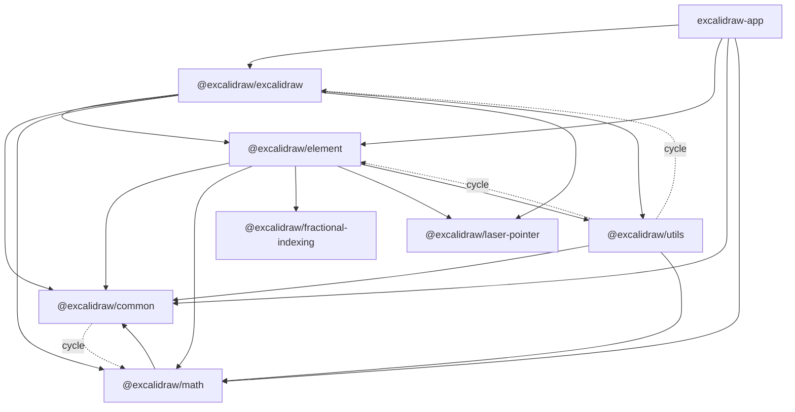
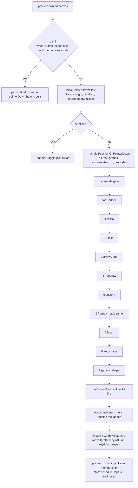
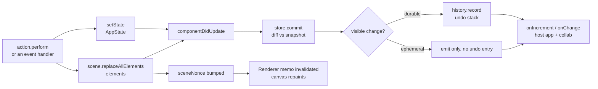
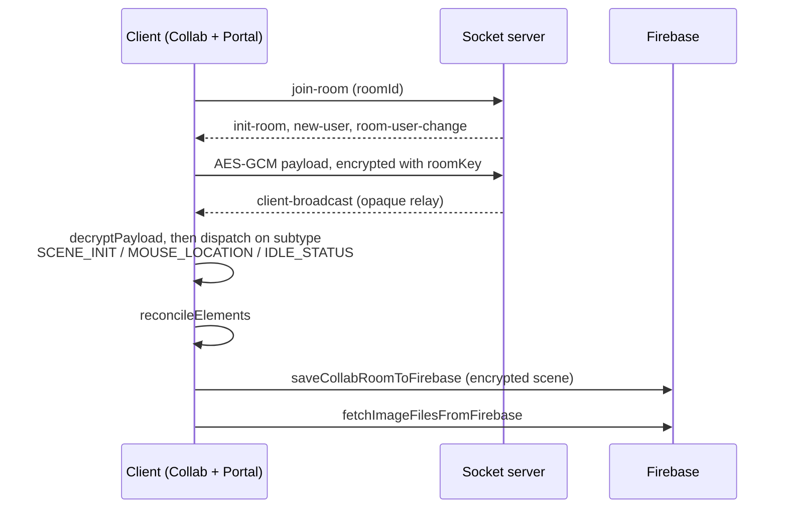

# Architecture map — Excalidraw codebase

A guide for someone who just joined this repo. It answers three questions:

1. What is this codebase made of?
2. Where do I put my hands for a given task?
3. Which parts are safe to touch, and which will bite?

Every fact here was checked against the source on branch `master`. Line numbers move, so treat them as hints, not contracts.

There is an interactive version of this same content next to it, `architecture.html` — a searchable module explorer, a clickable package-dependency matrix, and a filterable risk map. It is self-contained: no network, no build step, no embedded assets — download it and open it. It uses the system font stack rather than shipping typefaces, to keep the file small enough to version comfortably. GitHub will not render it in the browser, so use it locally. Its diagrams render only when the page is served by a host that supplies Mermaid; opened as a plain file they show their source instead, labelled as such.

---

## 1. What this repo is

A Yarn 1 monorepo (`yarn@1.22.22`, Node `>=18`) with three kinds of code:

| Part | What it is |
| --- | --- |
| `packages/*` | The editor engine and its support libraries. This is the product. |
| `excalidraw-app/` | The web app around it: persistence, collaboration, sharing, telemetry. |
| `examples/*` | Integration samples. Not part of the build we ship. |

Yarn workspaces are `["excalidraw-app", "packages/*", "examples/*"]`.

Rough size: the editor package is about 116k lines, the element engine 33k, the app 6.9k. One single file — `packages/excalidraw/components/App.tsx` — is 13,848 lines. Section 12 has the measured numbers.

---

## 2. The package map

Seven workspaces under `packages/`. All are named `@excalidraw/<dir>`. Sizes below are `src/` for the library packages; the `excalidraw` row is the whole package, because its code does not live under `src/`.



The dotted edges are the ones that close a cycle. `common -. cycle .-> element` exists too, but only at the type level, so it is left off.

### What each package is

| Package | Size | Role |
| --- | --: | --- |
| `common` | 3,915 LOC | Constants, generic utils, colors, keys, font metadata, event bus, small data structures (heap, queue, pool). |
| `math` | 2,351 LOC | Geometry: point, vector, line, segment, curve, ellipse, polygon, triangle, angle, range, PCA. |
| `element` | 33,183 LOC | The element engine: types, bounds, hit-testing, resize, binding, text, deltas, frames, groups, z-order. |
| `utils` | 801 LOC | Thin facade: `exportToCanvas/Blob/Svg/Clipboard` plus a geometric-shape abstraction. |
| `excalidraw` | ~116k LOC (81k excluding its tests) | The React editor component. Everything the user sees and touches. |
| `fractional-indexing` | 322 LOC | Vendored `generateNKeysBetween`. No tests. |
| `laser-pointer` | 527 LOC | Vendored laser trail maths. No tests. |

### Dependency direction, and where it breaks

The intended layering is `common` at the bottom, then `math`, then `element`, then `excalidraw` on top. Arrows in the diagram point from importer to imported, so `element --> common` means `element` depends on `common`. Reality has four deviations you will meet:

1. **`common ↔ math` is a real runtime cycle.** `math/src/range.ts:1` imports `toBrandedType` from `common`; `common/src/utils.ts:1` imports `average` from `math` (also `common/src/colors.ts:3-4`, `common/src/points.ts:1-6`).
2. **`element ↔ utils` is a real runtime cycle.** `element/src/bounds.ts:16` imports `getCurvePathOps` from `@excalidraw/utils/shape`; `utils/src/shape.ts:37` imports `getElementAbsoluteCoords` back from `@excalidraw/element`.
3. **`utils ↔ excalidraw` is a real runtime cycle too, and the surprising one.** `utils/src/export.ts` value-imports from six editor modules — `@excalidraw/excalidraw/appState`, `/clipboard`, `/data/image`, `/data/json`, `/data/restore`, `/scene/export` — while the editor imports `@excalidraw/utils` back in six source files (`index.tsx:417`, `components/ImageExportDialog.tsx`, `components/PublishLibrary.tsx`, `components/Stats/MultiDimension.tsx`, `components/TTDDialog/common.ts`, `hooks/useLibraryItemSvg.ts`) plus one test file. So `utils` is not a leaf; it sits between `element` and the editor and depends on both.
4. **`element` and `common` import types from the React package.** Inside `src/`, 33 files in `element` and 5 in `common` do `import type { AppState } from "@excalidraw/excalidraw/types"` or similar. Every one is type-only, so there is no runtime edge — the ESLint rule that enforces this is scoped to `src/**` with `allowTypeImports: true` (`packages/eslintrc.base.json`). Outside `src/`, the rule does not apply: the `global.d.ts` files in `element`, `common` and `math` carry bare side-effect imports, and 18 test files under `packages/element/tests/` value-import from the editor package, many of them pulling in the `Excalidraw` component itself. `common` also type-imports `element` (`constants.ts:4`, `font-metadata.ts:4`, `utils.ts:5`), making that pair a type-level cycle.

Practical effect: neither `element` nor `utils` can be lifted out on its own as a headless core. Within `src/`, `math` is the only package above `common` with no upward edge — though even its `global.d.ts` and one of its tests reach up, so "no upward edge" is a statement about source, not about the package directory.

### Highest fan-in

If you change one of these, you change everything downstream. Counted as distinct tracked `.ts`/`.tsx` files containing an import that resolves to the module, following the `vitest.config.mts` aliases, excluding `examples/`:

| File                                       | Files importing it |
| ------------------------------------------ | -----------------: |
| `packages/common/src/index.ts`             |                300 |
| `packages/element/src/types.ts`            |                215 |
| `packages/excalidraw/types.ts`             |                186 |
| `packages/element/src/index.ts`            |                142 |
| `packages/excalidraw/i18n.ts`              |                110 |
| `packages/excalidraw/components/icons.tsx` |                 97 |
| `packages/math/src/index.ts`               |                 91 |

---

## 3. The editor: what `App` owns

`packages/excalidraw/index.tsx` is the public entry. It exports `Excalidraw = React.memo(ExcalidrawBase, areEqual)`.

`areEqual` (`index.tsx:257-387`, 131 lines) is a **hand-written** comparison. It short-circuits on `children` first, then checks `activeTool`, `interaction`, `ui`, `UIOptions` (with per-key handling of `canvasActions` and special cases for `getFormFactor` and `export.saveFileToDisk`), `imageOptions`, and finally falls back to `isShallowEqual`. `initialData` is deliberately excluded. If you add a prop that holds an object, and you do not teach `areEqual` about it, memoization silently breaks in one direction or the other. No test enforces this.

Below that sits one class. **`packages/excalidraw/components/App.tsx` is 13,848 lines**, and `class App` starts at `:616` and runs to the end of it. It is the single biggest maintenance fact in the repo.

`App` declares over 60 instance fields (and around 260 class members in total). These eight are the collaborators you will meet first:

| Field           | What it is                                             |
| --------------- | ------------------------------------------------------ |
| `scene`         | `Scene` — the elements and their caches                |
| `renderer`      | `Renderer` — memoized visible-element computation      |
| `store`         | `Store` (private) — change capture, the source of undo |
| `history`       | `History` (private) — the undo/redo stacks             |
| `actionManager` | `ActionManager` — keyboard and panel action dispatch   |
| `library`       | `Library` — library items                              |
| `fonts`         | `Fonts` — font loading and subsetting                  |
| `rc`            | `RoughCanvas` — the hand-drawn renderer                |

Partially extracted helpers live beside it: `App.viewport.ts` (817), `App.drawshape.ts`, `App.flowchart.ts`, `App.cursor.ts`, `AppStateObserver.ts`. The extraction is partial and ongoing — new work should extend these rather than grow the class.

The public imperative API is stitched to `App`'s own signatures: roughly half of `ExcalidrawImperativeAPI`'s members in `types.ts` are `InstanceType<typeof App>["someMethod"]` aliases, and the rest are declared independently. So renaming a private method on `App` can change the published type surface. Check before you rename.

### The pointer-down state machine

Everything the user draws goes through `handleCanvasPointerDown` (`App.tsx:8267`).

The method is ~490 lines. The diagram below is its spine, not a transcription — steps are elided at every stage, and the ones shown are the ones you need in order to reason about tool behaviour.



Three things about this are worth committing to memory, because each one is easy to get backwards.

**The pan check comes first, and it swallows more than panning.** `handleCanvasPanUsingWheelOrSpaceDrag` returns `true` for the wheel button, `Space` held with the main button, **the hand tool being active**, or view mode with a non-capturing tool — all of it gated on a single active pointer, and the first three additionally on interaction or navigation being enabled. When it returns `true` the method returns immediately — no `PointerDownState` is built and the ladder is never reached. So the hand tool is handled here, not in the ladder: the negative guard on the ladder's last branch names `hand`, but in practice nothing with that tool active gets that far. (`interaction.enabled.tools` only accepts `laser` and `custom`, so a non-interactive editor cannot keep `hand` live either — the guard at the top of the method returns first.)

**The ladder order is lasso, text, arrow/line, freedraw, custom, frame/magicframe, laser, autoshape, then a generic branch.** `text` really is before the linear branch. The last branch is an `else if` with a negative guard rather than a bare `else`, so `eraser` and `image` fall through the whole chain. The eraser starts its trail in a _separate_ `if` at `App.tsx:8727`, after the `onPointerDown` callbacks have fired.

**The window listeners are conditional, and the condition is not simply "not view mode".** They are installed when `!viewModeEnabled || isActiveToolPointerCapturing()` — so view mode still gets them for a pointer-capturing tool such as the laser.

The two handlers returned by pointer-down are the largest methods in the file: `onPointerUpFromPointerDownHandler` (~1,000 lines) and `onPointerMoveFromPointerDownHandler` (~890 lines). Together they are 14% of `App.tsx`.

---

## 4. State: four mechanisms at once

This is the part that confuses every newcomer. There is no single store. There are four, and they have different jobs.



### 1. `this.state` — `AppState`

A React class state with **93 top-level fields** (`packages/excalidraw/types.ts:315-531`). It holds UI chrome, the in-progress interaction, the active tool, the `currentItem*` style defaults, the viewport, the selection, binding preferences, collaborators and the editor modes.

It is projected into narrower views so the UI does not re-render on every scroll (the two canvas ones are `Readonly<…>`; the others are just narrower): `UIAppState`, `StaticCanvasAppState`, `InteractiveCanvasAppState`, and — importantly — `ObservedAppState`, which is the **only** part of app state the Store diffs for history.

### 2. `Scene` — the elements

`packages/element/src/Scene.ts` (446 lines). Elements do not live in React state. `Scene` owns `elements`, `elementsMap`, `nonDeletedElements`, `nonDeletedElementsMap`, `frames`, `nonDeletedFramesLikes`, a selected-elements cache, and `sceneNonce`.

`replaceAllElements` rebuilds all the maps and then bumps `sceneNonce` via `triggerUpdate()`. The selected-elements cache is _not_ rebuilt there. Instead `getSelectedElements` compares identity on the way in and clears the cache itself when it no longer matches (`Scene.ts:205`); `destroy()` clears it again on teardown.

`sceneNonce` is the render cache key. Remember that name; section 5 uses it.

### 3. `Store` — change capture and undo source

`packages/element/src/store.ts` (1,037 lines). Every action declares its undo semantics with `CaptureUpdateAction`, which has exactly three values:

| Value | Meaning |
| --- | --- |
| `IMMEDIATELY` | Capture now — this is an undoable step. |
| `NEVER` | Do not capture. The source's examples are remote updates and scene initialization. |
| `EVENTUALLY` | Fold into the next capture. |

`Store.commit` diffs against a snapshot and emits a `DurableIncrement` (which history records) or an `EphemeralIncrement` (which it does not) — or, often, neither: it returns early when nothing changed, and skips an empty durable delta. It can also emit more than one, because it flushes queued micro-actions first. Getting the wrong `CaptureUpdateAction` on a new action does not crash anything — it silently corrupts undo. The source itself flags `scheduleCapture` as called from suspiciously many places.

The delta maths is next door in `packages/element/src/delta.ts` (2,071 lines): `Delta<T>`, `AppStateDelta`, `ElementsDelta`, plus the `DeltaContainer` interface. `ElementsDelta.applyTo` copies the map, applies added/removed/updated deltas, resolves conflicts, and returns `[SceneElementsMap, boolean]` where the boolean is whether the result contains a **visible** difference. A z-index flag is tracked internally but does not escape. The source describes the rollback as mimicking a transaction rather than being one: only the first phase rolls back, and a throw in the reorder/redraw phase is swallowed.

### 4. `History` — the stacks

`packages/excalidraw/history.ts` (249 lines). Thin layer over Store deltas. `HistoryDelta extends StoreDelta` and its `applyTo` passes `excludedProperties: new Set(["version", "versionNonce"])`, so an undo looks like a fresh user edit to collaborators instead of a version rollback.

### Jotai, and what it is _not_ for

`packages/excalidraw/editor-jotai.ts` uses `createIsolation()` from `jotai-scope`, so the editor's atoms never collide with a host app's. Atoms hold **UI-local** state: dialogs, color picker, sidebar, library, search, eyedropper. No atom holds the canvas elements — though `libraryItemsAtom` (`data/library.ts:108`) does hold library items, each of which contains its own `ExcalidrawElement[]`, so "no elements in atoms" would be too strong. ESLint blocks importing bare `jotai` — use `editor-jotai` (library) or `app-jotai` (app).

### Mutation

`packages/element/src/mutateElement.ts` is more conditional than it looks, and every condition matters for collab:

- If no field actually changed, it **returns early** and bumps nothing.
- The shape cache is evicted only when `width`, `height`, `fileId` or `points` appear in the update. Any other change leaves the cached shape in place.
- `version` and `versionNonce` are bumped **unless the caller supplied them** (`updates.version ?? element.version + 1`). Only `updated` moves on every real change.

So a call that changes nothing, or that passes its own `version`, produces no new version — which matters because collab reconciliation compares exactly those two fields. It is also not the entry point application code calls:

```
App.mutateElement  →  Scene.mutateElement  →  mutateElement
   (App.tsx:5247)      (Scene.ts:411)
```

`Scene.mutateElement` also decides whether to notify: it calls `triggerUpdate()` only when the element is in the scene map, the version actually changed, **and** the caller passed `informMutation`.

Thirteen files import from `./mutateElement` by relative path, though only six of those want the `mutateElement` function itself — the rest take `newElementWith`, `bumpVersion` or the `ElementUpdate` type. Others reach the function through the package barrel (`packages/element/src/index.ts:82` re-exports it): `Scene.ts`, `clipboard.ts`, `actionFrame.ts`, `LayerUI.tsx`, `ConvertElementTypePopup.tsx` — and `App.tsx` itself. Nothing in `excalidraw-app/` touches it at all.

`App.tsx`'s use of it is worth knowing about, because it is deliberate and it defeats the chain above. Four call sites around `App.tsx:12352-12390` call the raw function, each with the comment `// NOTE: We use the raw mutateElement() because we don't want history`. `ConvertElementTypePopup.tsx` does the same in three places while also using `app.scene.mutateElement` elsewhere in the same file. So the sanctioned chain is the default, not a guarantee: if a change is not showing up in undo, check whether the code path bypassed `Scene` on purpose. And there is mutation outside that path in production code — `restore.ts:728,793,796,813` assign element fields directly, and `transform.ts` reassigns element fields through `Object.assign` in over a dozen places. So "all mutation goes through one function" is the intent, not the invariant.

---

## 5. The render pipeline

Up to three stacked `<canvas>` elements. The static and interactive layers are each wrapped in `React.memo` with a hand-written comparison; the new-element layer is **not** wrapped at all, and that missing wrapper — not anything about its effects — is what lets it repaint freely.

It is also mounted conditionally, and the condition has a sharp edge: `Renderer.ts:99` computes the new-element canvas element as `newElement?.frameId ? null : newElement`, so drawing **inside a frame** unmounts the layer and pushes the in-progress element back onto the static canvas. Outside a frame you get three canvases while drawing and two the rest of the time.

| Layer | Component | Renderer | Why it exists |
| --- | --- | --- | --- |
| Static | `components/canvases/StaticCanvas.tsx` | `renderer/staticScene.ts` (508) | The finished drawing. Expensive; repaint rarely. |
| Interactive | `components/canvases/InteractiveCanvas.tsx` | `renderer/interactiveScene.ts` (2,102) | Selection, handles, binding highlights, remote cursors. |
| New element | `components/canvases/NewElementCanvas.tsx` | `renderer/renderNewElementScene.ts` (105) | The shape being drawn right now, so the static layer is not re-rasterized every frame. Not memoized, and not mounted when the new element belongs to a frame. |

`packages/excalidraw/scene/Renderer.ts` memoizes visible-element computation on a `canvasNonce`, built as the scene nonce plus, when the new element is inside a frame, its `versionNonce`. `staticScene.ts:489` wraps the static repaint in `throttleRAF`, but reaching that wrapper is conditional: `renderStaticScene` takes a `throttle` flag and calls the plain renderer when it is false. `StaticCanvas` supplies that flag as `isRenderThrottlingEnabled()`, which reads the `window.EXCALIDRAW_THROTTLE_RENDER` global — **off unless a host opts in**, and the web app is what opts in. `NewElementCanvas` has the same shape.

So in tests the static and new-element layers repaint synchronously because the flag is off and the throttled path is skipped entirely, not because of the `throttleRAF` mock in `setupTests.ts` (that mock exists, and matters for other throttled call sites, but it is not what is happening here). A handful of tests set the global to `true` deliberately — `tests/fitToContent.test.tsx` and `tests/scrollConstraints.test.tsx` — and those really do throttle. Exports call `renderStaticScene` with no flag, so they are unthrottled too.

There is a second cache below that. `ShapeCache` (`packages/element/src/shape.ts:82-165`) is a `WeakMap<ExcalidrawElement, {shape, theme}>` holding generated RoughJS shapes. `mutateElement.ts:136` evicts it, conditionally — and `ShapeCache.delete` clears a second cache, `elementWithCanvasCache`, at the same time. The catch: it is read on the **geometry** path too — `bounds.ts:968` reads it, and `linearElementEditor.ts:2008` calls `generateElementShape`, which _populates_ it. So a cache bug shows up as wrong hit-testing, not just wrong pixels.

`renderer/staticSvgScene.ts` (801 lines) is the SVG export twin of `staticScene.ts`. The two must be kept in step by hand. Drift is caught by `packages/excalidraw/tests/scene/export.test.ts`, and mostly by explicit assertions rather than snapshots — it makes 48 assertions of which only 4 are snapshots, querying the produced SVG DOM directly for fills, `viewBox`, masks and frame ids. So a failure there is usually a real regression to diagnose, not churn to regenerate.

---

## 6. The action system

Almost every user-facing command is an `Action`. `packages/excalidraw/actions/types.ts` defines the contract, with a closed `ActionName` union of **98 members** (`:45-143`).

```ts
{
  name, label, keywords?, icon?,
  PanelComponent?,        // how it renders in a panel
  perform,                // ActionResult | Promise<ActionResult>; ActionResult
                          // may also be `false`, meaning "refuse this action"
  keyTest?, keyPriority?, // keyboard binding
  predicate?,             // is it available right now?
  checked?,               // drives the checkmark in menus
  viewMode?, navigation?, // gating flags
  trackEvent              // required, but may be `false` to opt out
}
```

`ActionResult` is `{ elements?, appState?, files?, replaceFiles?, captureUpdate }`, or `false`.

`actions/manager.tsx` registers them and dispatches. Two behaviours worth knowing:

- `handleKeyDown` sorts candidates by `keyPriority`, filters them, and then **bails if more than one matches**, with `console.warn("Canceling as multiple actions match this shortcut")`. A new shortcut that collides therefore disables both, quietly.
- `isActionEnabled` evaluates **only** `predicate`.

### Gating is not one mechanism, and no single check covers every entry path

This is the part to get right before you try to hide a command, because each check guards a different door and none of them guards all of them.

| Check | Where it is evaluated | What it does not cover |
| --- | --- | --- |
| `UIOptions.canvasActions[name]` | `handleKeyDown` and `renderAction` | `executeAction`, so context menu, command palette and API dispatch go straight past it. It is also a closed 7-key `Partial` (`types.ts:984`), so for most of the 98 actions there is simply no key to set. |
| `action.viewMode` vs `appState.viewModeEnabled` | `handleKeyDown` only | `executeAction` and `renderAction`. The command palette re-implements the check for itself. |
| `action.navigation` vs `isInteractionEnabled()` / `isNavigationEnabled()` | `handleKeyDown` and `executeAction` | `executeAction` exempts `source === "api"` from this one. |
| `isActionBlockedByViewportTransition` (`manager.tsx:89`) | `handleKeyDown`, `executeAction`, `renderAction` | Nothing — this is the only check applied on all three paths, and API calls are not exempt. |
| `action.predicate` | **no dispatch path** — only inside `isActionEnabled`, which nothing in the manager calls on the way to running an action | Everything, by default. `isActionEnabled` is a method on `ActionManager`, but it is a query that individual call sites opt into (`HelpDialog`, `main-menu/DefaultItems`); the command palette and context menu re-implement the check themselves. |

That last row is the trap. A `predicate` returning `false` hides an action from the menus that bother to ask, and does nothing at all to its keyboard shortcut.

Four more things stop an action working, none of them a "gate":

- **Shortcut collision.** `handleKeyDown` sorts candidates by `keyPriority`, filters them, and then bails if more than one still matches, logging `"Canceling as multiple actions match this shortcut"`. A colliding shortcut disables both commands rather than picking one.
- **No `keyTest`** — never reachable by keyboard.
- **No `PanelComponent`** — `renderAction` has nothing to render.
- **Never registered.** `register()` works by module side effect, so an action in a file nothing imports does not exist at runtime. See the playbook in section 11.

### Where the action files are

| Concern | Files |
| --- | --- |
| Style / properties | `actionProperties.tsx` (2,165 — the whole style panel), `actionStyles.ts`, `actionBoundText.tsx` |
| Canvas & view | `actionCanvas.tsx`, the `actionToggle*` files (note `actionToggleSearchMenu.ts` is `.ts`) |
| Selection/geometry | `actionSelectAll.ts`, `actionAlign.tsx`, `actionDistribute.tsx`, `actionFlip.ts`, `actionZindex.tsx`, `actionGroup.tsx` |
| Lifecycle | `actionFinalize.tsx`, `actionDeleteSelected.tsx`, `actionDuplicateSelection.tsx`, `actionHistory.tsx`, `actionElementLock.ts` |
| Input/output | `actionExport.tsx`, `actionClipboard.tsx`, `actionAddToLibrary.ts` |
| Other | `actionNavigate.tsx` (follow a collaborator), `actionMenu.tsx` (open the help dialog), `actionLink.tsx` (element hyperlink) |

There are 41 `action*` files, of which 36 are action modules and 5 are their tests.

---

## 7. The element engine, by concern

`packages/element/src/` is 50 non-test source files and 33k lines. Grouped by what they do:

| Concern | Key files | LOC of the big ones |
| --- | --- | --- |
| Types & schema | `types.ts`, `typeChecks.ts`, `comparisons.ts`, `transform.ts` | types 460, transform 815 |
| Bounds & geometry | `bounds.ts`, `utils.ts`, `distance.ts`, `sizeHelpers.ts` | bounds 1,570, utils 754 |
| Collision / hit-test | `collision.ts`, `shape.ts` | collision 867, shape 1,288 |
| Resize & transform | `resizeElements.ts`, `resizeTest.ts`, `transformHandles.ts`, `dragElements.ts`, `cropElement.ts` | resizeElements 1,511, cropElement 628 |
| Mutation | `mutateElement.ts`, `Scene.ts` | Scene 446 |
| Arrow binding | `binding.ts`, `arrows/focus.ts`, `arrowheads.ts` | **binding 3,156 — biggest engine file** |
| Elbow arrows | `elbowArrow.ts`, `heading.ts` | elbowArrow 2,309 |
| Linear element editing | `linearElementEditor.ts` | 2,525 |
| Text | `textElement.ts`, `textWrapping.ts`, `textMeasurements.ts`, `containerCache.ts` | textWrapping 740 |
| Deltas & store | `delta.ts`, `store.ts` | delta 2,071, store 1,037 |
| Ordering | `fractionalIndex.ts`, `zindex.ts`, `sortElements.ts` | zindex 676 |
| Groups & selection | `groups.ts`, `selection.ts` | groups 466 |
| Frames | `frame.ts` | 1,011 |
| Flowchart | `flowchart.ts` | 748 |
| Shape recognition | `convertToShape.ts` (+ `math/src/pca.ts`) | 817 |
| Images & embeds | `image.ts`, `embeddable.ts`, `elementLink.ts` | embeddable 535 |
| Creation | `newElement.ts`, `duplicate.ts` | newElement 555, duplicate 518 |
| Rendering | `renderElement.ts`, `visualdebug.ts` | renderElement 1,050 |

### Type safety in `math`

`packages/math/src/types.ts` defines 15 branded types: `Radians`, `Degrees`, `InclusiveRange`, `GlobalPoint`, `GlobalCoord`, `LocalPoint`, `LocalCoord`, `Line`, `LineSegment`, `Vector`, `Triangle`, `Rectangle`, `Polygon`, `Curve`, `Ellipse`.

A brand is a phantom field, e.g. `type Radians = number & { _brand: "excalimath__radian" }`. It costs nothing at runtime and stops you passing degrees into trig code, or scene coordinates into element-local maths. Most geometry functions are generic over `<Point extends GlobalPoint | LocalPoint>` so they work in either space but cannot mix spaces inside one call.

Two caveats that were verified, not assumed:

- Brands are produced mostly by inline `as` casts, not by factory functions. There are **144** `as Radians | Degrees | GlobalPoint | LocalPoint` casts outside `packages/math`. So the brand is a convention held up by review, not something the compiler can fully police.
- `InclusiveRange` reuses `Degrees`' brand string (`"excalimath_degree"`) — a copy-paste slip. The differing base type still keeps the two distinct, so nothing is broken today.

---

## 8. Data, persistence and migrations

Two layers, easy to confuse.

### Editor-side: `packages/excalidraw/data/`

| File | LOC | Job |
| --- | --: | --- |
| `restore.ts` | 1,202 | The migration funnel. Everything loaded from anywhere passes here. |
| `library.ts` | 1,001 | The `Library` class, merge and hashing of library items. |
| `blob.ts` | 559 | `loadFromBlob`, image decode/resize, data URLs. |
| `encode.ts` | 414 | Scene embedded in PNG/SVG, compression. |
| `json.ts` | 159 | `serializeAsJSON`, `loadFromJSON`, `saveAsJSON`. |
| `reconcile.ts` | 118 | Collab merge: `reconcileElements`, `shouldDiscardRemoteElement`. |
| `encryption.ts` | 94 | AES helpers used by collab and share links. |
| `index.ts` | 219 | `prepareElementsForExport`, `exportCanvas`. Note the app has its own `data/index.ts` — different file, same name. |
| `ai/types.ts` | 300 | Request and response types for the AI endpoints. |

That is the bulk of the directory, not all of it. The remainder is `filesystem.ts`, `image.ts`, `types.ts`, `resave.ts`, `EditorLocalStorage.ts` and a test file.

`restore.ts` is worth understanding properly, because it is widely misunderstood:

- `restoreElementWithProperties` (`:408`) builds `{ ...element, ...base, ...getNormalizedDimensions(base), ...extra }` — it **spreads the original element first, explicitly to keep unknown properties for forward compatibility**. So a new custom property is _not_ stripped here. Only two legacy fields are deleted there: `strokeSharpness` and `boundElementIds` (the file also drops `rawText` elsewhere).
- What a new property _does_ miss by not being registered here is **normalization and defaulting**. And it can still be dropped by other paths — export cleaning, serialization.
- `repairBinding` (`:276`) contains a real schema migration: binding v1 (legacy) → v2 at `:325`, plus legacy focus-point handling.

It is guarded mainly by `packages/excalidraw/tests/data/restore.test.ts` (1,268 lines) — mostly explicit assertions, with a handful of snapshots.

### App-side: `excalidraw-app/data/`

`LocalData` debounce-saves elements and app state to `localStorage` (`SAVE_TO_LOCAL_STORAGE_TIMEOUT`), and keeps binary files in IndexedDB (`createStore("files-db", "files-store")`). Keys are in `excalidraw-app/app_constants.ts` (app root, not under `data/`):

```
excalidraw            -> elements
excalidraw-state      -> app state
excalidraw-collab     -> just the local username
excalidraw-theme      -> theme
excalidraw-debug      -> debug flags
version-dataState     -> cross-tab version stamp
version-files         -> cross-tab version stamp
excalidraw-library    -> IndexedDB library
excalidraw-ttd-chats  -> IndexedDB AI chat history
```

That is the complete `STORAGE_KEYS` set, minus one legacy migration-only key (`__LEGACY_LOCAL_STORAGE_LIBRARY`). **Every one of them is per-origin.** None is keyed _by_ a user or a document — the only user data in there is the collaboration display name, stored as `{ username }` — so anything multi-user or multi-document needs a real backend, not a change here.

---

## 9. The app shell and what it talks to

`excalidraw-app/` is ~6.9k lines. There is no router. The app makes two pathname decisions: `excalidraw-app/App.tsx:1266` checks for `/excalidraw-plus-export`, and an inline script in `excalidraw-app/index.html:110` checks for `/` before the Plus redirect. Everything else is driven by hash and query state (`#room=`, `#json=`, `#url=`, `?id=`) resolved during `initializeScene` — the room link itself is matched by `getCollaborationLinkData` in `excalidraw-app/data/index.ts`, not inline.

That scene-init step then rewrites the URL to the bare origin with `history.replaceState` — but **not** when there is a collaboration room link. `#room=` is deliberately preserved (the guard is at `App.tsx:282`), because the room's encryption key lives in that fragment and erasing it would lock the user out of their own session. Room links also skip the overwrite-current-scene prompt entirely, so there is no path on which a `#room=` fragment gets erased here; leaving a room is handled separately, in `collab/Collab.tsx`.

The PWA share target is a different mechanism entirely: `/web-share-target` is declared in the `vite.config.mts` manifest, and the runtime branch that handles it is a query-parameter check inside the editor package, not the app.

Collaboration is socket.io plus Firebase:

`Portal` and `Collab` are both client-side classes; only the socket server and Firebase are remote.



Note what the server does and does not know. Its own events are `init-room`, `new-user`, `room-user-change`, `client-broadcast` and `first-in-room`; the application message types (`SCENE_INIT`, `MOUSE_LOCATION`, `IDLE_STATUS`) are subtypes _inside_ the encrypted payload, which it relays without reading. Anyone standing up their own room server implements the relay, not the protocol above it.

The room key never reaches the server: the scene is encrypted client-side, and the key lives in the URL fragment. `reconcileElements` does not go straight to versions — `shouldDiscardRemoteElement` first checks whether that element is the one you are currently editing text in, resizing, or creating, and only then compares `version`, with the lower `versionNonce` as a tiebreak. The version comparison is why `HistoryDelta` excludes those two fields on undo.

### External integrations configured in this fork

Production disables every Excalidraw-owned integration below. The endpoint values remain in `.env.production`, but the Unobravo feature layer gates the code that can reach them; `VITE_APP_DISABLE_SENTRY=true` separately disables the hardcoded Sentry DSN. The production env test asserts all six gates stay closed and query-string overrides stay disabled.

| Service | Configured endpoint | Production behavior |
| --- | --- | --- |
| Socket server | `oss-collab.excalidraw.com` (`transports: ["websocket","polling"]`) | Dormant while `VITE_APP_UNOBRAVO_ENABLE_COLLABORATION=false` |
| Firebase (Firestore + Storage) | project `excalidraw-room-persistence` | Dormant while collaboration, share links and Excalidraw+ are disabled |
| Share-link JSON backend | `json.excalidraw.com/api/v2/` | Dormant while `VITE_APP_UNOBRAVO_ENABLE_SHARE_LINKS=false`; `#json=` and legacy `?id=` links are ignored |
| Libraries | `libraries.excalidraw.com` + a GCP cloud function | Dormant while `VITE_APP_UNOBRAVO_ENABLE_LIBRARY=false`; library writes are refused |
| Excalidraw Plus | `plus.excalidraw.com`, `app.excalidraw.com` | Upsells, links, export and the iframe bridge are disabled by `VITE_APP_UNOBRAVO_ENABLE_PLUS=false` |
| AI | `oss-ai.excalidraw.com/v1/ai/*` | AI surfaces and their request-producing components are unmounted while `VITE_APP_UNOBRAVO_ENABLE_AI=false` |
| Sentry | Excalidraw's hardcoded DSN | Disabled in production by `VITE_APP_DISABLE_SENTRY=true`, including `*.vercel.app` previews |
| Simple Analytics | previously `scripts.simpleanalyticscdn.com/latest.js` | Loader removed from `index.html` |
| Fonts | same-origin `/fonts/` assets | Excalidraw's font CDN and the Google Fonts preconnects are removed; the build fails if required local assets are missing |

The old Excalidraw+ cookie redirect from `/` to `app.excalidraw.com` was also removed from `index.html`. These gates deliberately fail open when their env vars are absent so an unconfigured build preserves upstream behavior; `.env.production` plus `unobravo/tests/envProduction.test.ts` are therefore part of the privacy boundary, not optional documentation.

`.env.production` still commits a Firebase web API key and an RSA public key. Both are public-by-design for their purpose and currently unreachable through the disabled production features, but they still identify Excalidraw's projects.

---

## 10. Risk map — what is safe to touch

Risk here means one thing: how likely is it that editing this file goes wrong, or that you fail to notice it went wrong. Three tiers.

### Hot — dense, high-churn, and failures are quiet

| File | LOC | Why |
| --- | --: | --- |
| `packages/excalidraw/components/App.tsx` | 13,848 | Biggest file, 20+ collaborators, 93-field state, and it implements the public API surface. |
| `packages/element/src/binding.ts` | 3,156 | Biggest engine file. Churns constantly and cross-cuts elbow arrows, linear editing, frames. |
| `packages/element/src/linearElementEditor.ts` | 2,525 | Stateful class mixing pointer interaction, point normalization and mutation. |
| `packages/element/src/elbowArrow.ts` | 2,309 | A\* routing with tuned heuristics. Small numeric changes move routes; not reviewable by reading. |
| `packages/element/src/delta.ts` | 2,071 | Undo and collab reconciliation core. Failures are silent, not loud. |
| `packages/element/src/store.ts` | 1,037 | `CaptureUpdateAction` semantics. Wrong value = corrupted undo. **No dedicated test file.** |
| `packages/excalidraw/renderer/interactiveScene.ts` | 2,102 | High-churn code; ~670 lines are binding visualization alone. |
| `packages/excalidraw/actions/actionProperties.tsx` | 2,165 | The entire style panel in one file. Every new element property lands here. |

### Warm — safe to edit, but read first

| File | LOC | Why |
| --- | --: | --- |
| `packages/element/src/bounds.ts` | 1,570 | High fan-in, and `ElementBounds` caching makes bugs stateful. |
| `packages/element/src/resizeElements.ts` | 1,511 | Dense transform maths across every element type, bound text, frames, crop. |
| `packages/element/src/shape.ts` | 1,288 | `ShapeCache` feeds both painting and hit-testing. No dedicated test. |
| `packages/excalidraw/data/restore.ts` | 1,202 | Migration funnel with a live v1→v2 binding migration. Well tested, but by assertions you have to read. |
| `packages/common/src/utils.ts` | 1,202 | 94 unrelated exports, imported nearly everywhere. |
| `packages/element/src/frame.ts` | 1,011 | Frame membership interacts with groups, z-order, duplication and selection. |
| `packages/element/src/renderElement.ts` | 1,050 | Per-element canvas drawing plus its own canvas cache. No dedicated test. |
| `packages/excalidraw/types.ts` | 1,428 | `AppState` and the projections. Adding a field ripples into the Store's diffing. |
| `packages/excalidraw/snapping.ts` | 1,414 | Dense geometry that interacts with drag, resize and frames. |
| `packages/element/src/collision.ts` | 867 | Correctness depends on `shape.ts`'s cache plus float precision. Bugs are subtle. |
| `packages/excalidraw/renderer/staticSvgScene.ts` | 801 | Must stay in step with `staticScene.ts` by hand. |
| `packages/element/src/convertToShape.ts` | 817 | Newest feature area (shape recognition). Expect churn. |
| `packages/excalidraw/index.tsx` | 536 | The hand-written `areEqual`. Silent memoization bugs, no test. |

### Cool — comparatively safe

- `packages/math/**` — pure, branded, well tested (9 test files).
- `packages/common/src/{keys,queue,binary-heap,url}.ts` — small, and each has its own test file. `random.ts` and `emitter.ts` have no test file of their own, but both are exercised constantly: `Emitter` through `appEventBus.test.ts`, and `randomInteger` on every element version bump.
- `packages/excalidraw/components/icons.tsx` (2,561) — big but inert SVG.
- `packages/excalidraw/components/TTDDialog/**` — 44 files, 5,828 lines of `.ts`/`.tsx` (7.0k counting its stylesheets). An optional AI feature, cleanly separable.

### Treat as binary

`packages/excalidraw/subset/woff2/woff2-bindings.ts` (4,051 lines) is generated Emscripten output. Never hand-edit; exclude it from review.

### Test coverage gaps worth knowing

These have **no test file of their own**: `element/src/store.ts`, `element/src/Scene.ts`, `element/src/mutateElement.ts`, `element/src/shape.ts`, `element/src/renderElement.ts`, `element/src/heading.ts`. (`utils/src/shape.ts` is a different file, and it _is_ tested — by `packages/utils/tests/geometry.test.ts`.)

How well each is actually covered varies a lot, so check before assuming you are working without a net. `store.ts` is exercised hard by `packages/excalidraw/tests/history.test.tsx` (5,308 lines), which imports `CaptureUpdateAction` and `StoreDelta` and asserts on store internals directly. `Scene.ts` and `mutateElement.ts` show up in tests as fixtures rather than as subjects. `renderElement.ts` and `heading.ts` are referenced by no test at all.

The reverse case is common rather than exceptional — plenty of modules are tested under a filename that does not match them: `groups.ts` via `packages/element/tests/zindex.test.tsx`, `resizeElements.ts` via `tests/resize.test.tsx`, `convertToShape.ts` via `tests/recognizeShape.test.ts`, `distance.ts` via `tests/collision.test.tsx`, `textMeasurements.ts` via `tests/textElement.test.ts`, `components/App.viewport.ts` via `tests/scrollConstraints.test.tsx` and `tests/fitToContent.test.tsx`, and others. So a filename grep misleads in both directions; grep the suite for the module's exported names instead. `binding.ts` does have its own tests. `fractional-indexing` and `laser-pointer` have none at all.

---

## 11. Playbooks — where to put your hands

### Add a new tool

1. `packages/element/src/types.ts` — the element type, if it is a new element.
2. `packages/common/src/constants.ts` — tool constant.
3. `packages/excalidraw/components/App.tsx` — a branch in the pointer-down ladder (`~:8555-8720`), plus pointer-move and pointer-up handling.
4. `packages/excalidraw/components/Tools.tsx` and `MobileToolbar.tsx` — the button, on both form factors.
5. `packages/element/src/{newElement,bounds,collision,renderElement}.ts` — create, measure, hit-test, draw.
6. `packages/excalidraw/renderer/staticSvgScene.ts` — the SVG export twin, or export silently omits your tool.
7. `packages/excalidraw/data/restore.ts` — normalization and defaults.

**Cost: high.** This touches most hot files. Expect snapshot churn.

### Add an action (a command or shortcut)

1. New `actions/actionX.tsx`, using `register()`.
2. **Make the file reachable by an import.** `register()` is a module side effect, so an action nobody imports is never registered — it typechecks, it looks finished, and at runtime it does not exist. Add it to the `actions/index.ts` barrel (which `App.tsx` imports), or import it directly from a shared file the way `actionFrame.ts` and `actionToggleShapeSwitch.tsx` are.
3. Add its name to the `ActionName` union in `actions/types.ts`.
4. If you want it listed in the Help dialog, add it to `ShortcutName` in `actions/shortcuts.ts` — a second closed union.
5. Choose `captureUpdate` deliberately — this is your undo behaviour.
6. If it has a `keyTest`, check no other action matches the same combination, or both die.
7. Decide which checks from section 6 should apply, and remember `predicate` alone will not stop the shortcut.

**Cost: low**, but there are two or three shared edits, not one — and step 2 is the one that fails silently.

### Add a property to an element

1. `packages/element/src/types.ts` — the field.
2. `packages/excalidraw/data/restore.ts` — normalization and default. Unknown fields survive the spread, but they arrive unnormalized.
3. `packages/element/src/newElement.ts` — the initial value.
4. `packages/element/src/renderElement.ts` and `renderer/staticSvgScene.ts` — if it is visual.
5. `packages/excalidraw/actions/actionProperties.tsx` — if it is user-editable.
6. Check undo behaves: the Store diffs the element, so a new field participates automatically.

**Cost: medium.** Expect restore and export snapshots to move.

### Hide or disable a feature

`UIOptions` is the supported seam — a host app can switch off canvas actions and tools through props, without touching editor code. But read section 6 first: `UIOptions.canvasActions` is a closed 7-key set that only bites in `handleKeyDown` and `renderAction`, so it will not cover most actions and will not cover `executeAction` at all.

Work the entry paths, not the checks. For each capability, ask: keyboard shortcut, command palette, context menu, main menu, welcome screen, mobile toolbar (a separate code path from the desktop one), paste and drop ingress, and the imperative API. Then test that the affordance is _gone_, not merely hidden.

**Cost: low if the seam exists, medium if you have to patch editor code.**

### Change persistence

1. `excalidraw-app/data/LocalData.ts` and `data/localStorage.ts` — the local layer.
2. `excalidraw-app/data/firebase.ts` — the remote scene and file store.
3. `excalidraw-app/data/index.ts` — share-link backend (`BACKEND_V2_GET/POST`).
4. `excalidraw-app/collab/Collab.tsx` — calls `saveCollabRoomToFirebase` and `fetchImageFilesFromFirebase`.
5. Keep `packages/excalidraw/data/reconcile.ts` as-is — the merge logic is transport-agnostic.
6. If you need per-user or per-document scoping, that is new work: `app_constants.ts` `STORAGE_KEYS` has no identity today, and `files-db` in IndexedDB is not scoped either.

**Cost: medium.** All in `excalidraw-app/`, which changes far less often than the engine.

### Move collaboration to your own infrastructure

`VITE_APP_WS_SERVER_URL` is still configured as `oss-collab.excalidraw.com`, but production never reaches it while `VITE_APP_UNOBRAVO_ENABLE_COLLABORATION=false`. The server is `excalidraw/excalidraw-room`; `Portal.tsx` encrypts before emitting, so it never sees plaintext. To re-enable collaboration: run that server or a compatible replacement, change the endpoint, replace the Firebase persistence calls in `Collab.tsx`, and only then flip the feature flag. Decide about `transports: ["websocket", "polling"]` — polling is the fallback and changes the infrastructure requirements.

### Maintain or re-enable Excalidraw Plus, AI and telemetry

- Plus is gated by `VITE_APP_UNOBRAVO_ENABLE_PLUS`; the app-shell overlays, command palette, export UI and `/excalidraw-plus-export` bridge all follow it. Re-enable it only after repointing the Plus endpoints and reviewing the export path.
- AI is gated by `VITE_APP_UNOBRAVO_ENABLE_AI`; `AIComponents` and `TTDDialogTrigger` are not mounted while it is off. Mermaid remains available locally.
- Sentry is disabled by `VITE_APP_DISABLE_SENTRY=true`. Simple Analytics was removed from `index.html` rather than hidden behind a runtime flag.
- The source of truth for every modified upstream surface is `unobravo/FORK.md`; `yarn fork:check` verifies the register and overlay hashes.

**Cost: low.** These are leaf features in app code.

---

## 12. Metrics

Measured on `master` at the time of writing, over tracked `.ts`/`.tsx` files only (`git ls-files`, so no `node_modules`, no `examples/`).

### Lines of code

| Area                                |    LOC |
| ----------------------------------- | -----: |
| `packages/excalidraw/components/`   | 48,992 |
| `packages/element/src/`             | 33,183 |
| `packages/excalidraw/tests/`        | 26,447 |
| `packages/excalidraw/actions/`      |  9,634 |
| `excalidraw-app/`                   |  6,851 |
| `packages/excalidraw/subset/`       |  4,751 |
| `packages/excalidraw/data/`         |  4,488 |
| `packages/excalidraw/renderer/`     |  4,138 |
| `packages/common/src/`              |  3,915 |
| `packages/excalidraw/wysiwyg/`      |  2,991 |
| `packages/math/src/`                |  2,351 |
| `packages/utils/src/`               |    801 |
| `packages/laser-pointer/src/`       |    527 |
| `packages/fractional-indexing/src/` |    322 |

### Ten largest `.ts`/`.tsx` files

Two of these are not hand-written product code: `history.test.tsx` is a test, and `woff2-bindings.ts` is generated.

| File                                                 |    LOC |
| ---------------------------------------------------- | -----: |
| `packages/excalidraw/components/App.tsx`             | 13,848 |
| `packages/excalidraw/tests/history.test.tsx`         |  5,308 |
| `packages/excalidraw/subset/woff2/woff2-bindings.ts` |  4,051 |
| `packages/element/src/binding.ts`                    |  3,156 |
| `packages/excalidraw/components/icons.tsx`           |  2,561 |
| `packages/element/src/linearElementEditor.ts`        |  2,525 |
| `packages/element/src/elbowArrow.ts`                 |  2,309 |
| `packages/excalidraw/actions/actionProperties.tsx`   |  2,165 |
| `packages/excalidraw/renderer/interactiveScene.ts`   |  2,102 |
| `packages/element/src/delta.ts`                      |  2,071 |

### Counts

| Thing                       |  Count |
| --------------------------- | -----: |
| Test files                  |    116 |
| `it` / `test` blocks        | ~1,600 |
| Snapshot files              |     24 |
| `ActionName` members        |     98 |
| `AppState` top-level fields |     93 |
| `action*` files             |     41 |
| Locale JSON files           |     58 |
| Branded types in `math`     |     15 |

One of those 58 JSON files is `percentages.json`, generated translation-coverage metadata, so there are 57 actual locales.

Test files per package: `packages/excalidraw` 70, `element` 24, `math` 9, `common` 7, `utils` 3, `excalidraw-app` 3, `fractional-indexing` 0, `laser-pointer` 0 — 116 in total. The `it`/`test` block count lands between roughly 1,590 and 1,620 depending on how `it.each` and `describe.each` are counted, hence the tilde. Coverage thresholds in `vitest.config.mts`: lines 60, branches 70, functions 63, statements 60.

---

## 13. Onboarding

### Commands

```bash
yarn start              # dev server (excalidraw-app)
yarn test:typecheck     # tsc, no emit
yarn test:app           # vitest (watch)
yarn test:update        # vitest, update snapshots, single run
yarn test:all           # typecheck + eslint (max-warnings=0) + prettier check + tests
yarn test:coverage      # vitest with coverage thresholds
yarn fix                # prettier --write then eslint --fix
yarn build:packages     # ordered esm builds of the libraries
yarn build              # build the app
```

Run `yarn test:update` before committing anything that touches rendering or state — 24 snapshot files will move.

### Tests

Vitest with jsdom, `globals: true`, `setupFiles: ["./setupTests.ts"]` (which brings in `vitest-canvas-mock`). Path aliases map every `@excalidraw/*` to **source**, so tests need no build step.

The interaction DSL is what makes editor tests readable:

- `packages/excalidraw/tests/helpers/ui.ts` — `UI`, `Pointer`, `Keyboard`
- `packages/excalidraw/tests/helpers/api.ts` — `API.createElement`, `API.setElements`, `API.setAppState`
- `packages/excalidraw/tests/test-utils.ts` — `assertSelectedElements`, plus `render` (a re-export of `renderApp`, so grepping for `export const render` finds nothing)

### Lint rules that will bite you

- `@typescript-eslint/consistent-type-imports` is an **error**: type imports must be separate.
- `import/order` — `@excalidraw/**` is not its own group; it is a `pathGroups` entry positioned _after_ the `external` group. `type` imports are their own group, last. `newlines-between` is `always-and-inside-groups`, so blank lines _within_ a group are allowed. The rule is a warning, but `test:code` runs `eslint --max-warnings=0`, so it still fails CI.
- Importing bare `jotai` is banned — use `editor-jotai` or `app-jotai`.
- Prettier covers `**/*.{css,scss,json,md,html,yml}`, so documentation files are lint-gated too.

### CI

Fourteen workflows in `.github/workflows/`, eleven of them upstream's. On pull requests: `lint.yml`, `test-coverage-pr.yml`, `size-limit.yml`, `semantic-pr-title.yml` (conventional-commit PR titles), and `cancel.yml` (which also runs on pushes to `release`). On push to `master`: `test.yml`, plus our `unobravo-deploy.yml`. On push to `release`: the autorelease, Docker build and publish, and Sentry release workflows — none of which have ever run, because this fork has no `release` branch, and creating one would publish to Docker Hub and npm under upstream's names. `locales-coverage.yml` runs only on pushes to the Crowdin branch `l10n_master`. The remaining two are ours and only run when called or dispatched.

### Deploy

The live deployment is **S3 + CloudFront**, one bucket and distribution per environment: `whiteboard.unobravo.xyz` (staging) and `whiteboard.unobravo.com` (production). `unobravo-deploy.yml` builds once on every push to `master` and promotes the same artifact to staging and then production, with no approval gate; `unobravo-deploy-manual.yml` deploys an arbitrary ref to one environment, which is the rollback path; `unobravo-deploy-app.yml` is the reusable half that both call. Credentials are OIDC role assumption, and every AWS identifier comes from a repository variable. `unobravo/FORK.md` has the full description, including why a release is identified by its commit rather than a tag.

Two paths upstream ships that this fork does not use:

- **Vercel**: `outputDirectory: excalidraw-app/build`, with headers including `Access-Control-Allow-Origin: https://excalidraw.com`.
- **Docker**: multi-stage build onto a digest-pinned `nginx:stable-alpine-slim`. Env is inlined by Vite at build time, so the image is not configurable at run time. It cannot currently build: `.dockerignore` does not re-include `unobravo/`, which `excalidraw-app/vite.config.mts` and `App.tsx` both import from.

---

## Appendix: reading order for your first week

1. `packages/excalidraw/index.tsx` — the public shape of the thing.
2. `packages/excalidraw/types.ts` — `AppState`, `ExcalidrawProps`, `ExcalidrawImperativeAPI`.
3. `packages/element/src/types.ts` — what an element is.
4. `packages/element/src/Scene.ts` — where elements actually live.
5. `packages/element/src/store.ts` + `packages/excalidraw/history.ts` — undo.
6. `packages/excalidraw/actions/manager.tsx` + one small action — how commands work.
7. `packages/excalidraw/scene/Renderer.ts` + `renderer/staticScene.ts` — how it paints.
8. `packages/excalidraw/components/App.tsx` — last, and only the method you need.
